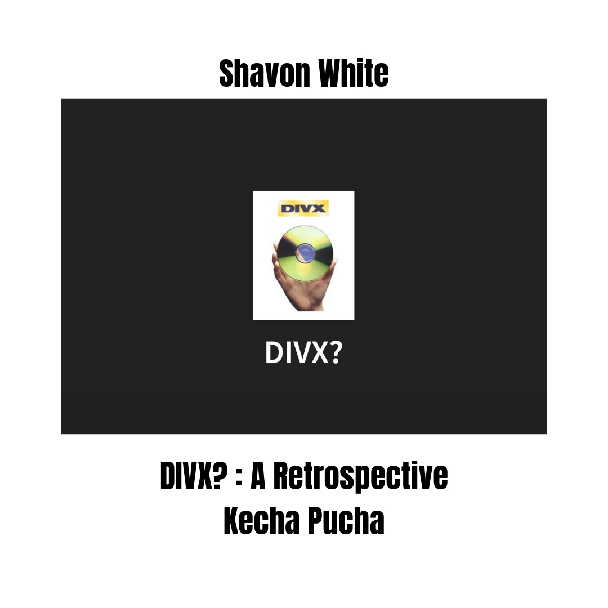

# IASC 2P02 - Shavon White
## Bio
Hello World! I am Shavon White, a 2nd year IASC Student with an interest in visual storytelling. I find myself most interested in the media archaeology aspect of the digital humanities. Specifically, looking at alternate technological outcomes that could have existed under different circumstances really peaks my interest. The projects that I've worked on throughout my second year of the IASC program reflect this, especially my Kecha Pucha presentation. In it, I disucss the history of an experimental DVD rental service and the potential outcomes we might've seen today had it not been a commercial failure. Aside from that, I've also worked on an academic blog post outlining the importance of shared data sets and created several personal proejcts that have expanded my creative horizons by a considerable amount since the start of the school year. Going forward, I intend to expand on my portfolio by continuing to write Blog Posts about content that interests me and by creating more engaging presentations in the Kecha Pucha format. This year I was able to make an attempt at both of these formats, and I believe that doing so has given me a chance to identify my strengths and weaknesses, which will give me self improvement goals to work on as I continue my academic journey.

## Featured Project

This retrospective Kecha Pucha looks at the history of DIVX as a platform (from it's origin to its demise) and what today's media delivery landscape could have looked like had things turned out differently. When approaching this assignment, I took great care to answer two questions: Why did DIVX fail? and how could it's hypothetical success in this endeavour have led to the appearance of different trends in the digital sphere? To answer these questions, I first looked at what our current most prevalent media consumtion platforms have in common. One of the most important factors that I identified was the ability for the consumer to access the content at any time. This is a feature found in the leading delivery platforms of video content, audio content, and photographic content. The stremaing model is fundamentally opposed to DIVX's business model, which was very strict comparatively. The research I did to put together this Kecha Pucha is important to the understanding of modern consumer culture pertaining to digital media.

I took Dr. ALex Christie's feedback and incorporated a slide about Netflix's history as a DVD rental business [Here](https://github.com/ShavonSnow/IASC-2P02/commit/6215c2b3d740fc8055a520fb4df3264037cdfaf8) (Line 87). I also tried projecting some of our modern rental technologies/solutions onto the hypothetical modern iteration of DIVX by adding a slide discussing RedBox [Here](https://github.com/ShavonSnow/IASC-2P02/commit/6215c2b3d740fc8055a520fb4df3264037cdfaf8)(Line 112). While RedBox isn't the only video rental service, it is one of the most commercially successful, and is arguably what DIVX envisioned themselves becoming. Finally, I expanded on my main argument pertaining to why DIVX failed by exploring the importance of choice for the end user and how DIVX's anti consumer set up was what stopped them from truly competing with their contemporaries. This can be found [Here](https://github.com/ShavonSnow/IASC-2P02/commit/6215c2b3d740fc8055a520fb4df3264037cdfaf8) (Line 150).

## Collaborative Project
[Scalar Group Presentation](Collab.md)

## Research Presentation

[DIVX? A Retrospective](reveal/index.html)

## Academic Blog

[Why We Should Keep Using Established Data Sets ](blog.md)

